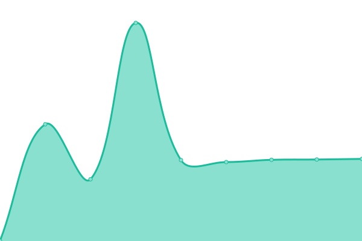

# [📈 Live Status](https://skoc10.github.io/status-websites): <!--live status--> **🟧 Partial outage**

This repository contains the open-source uptime monitor and status page for [selman koc](https://skoc10.github.io/status-websites), powered by [Upptime](https://github.com/upptime/upptime).

With [Upptime](https://upptime.js.org), you can get your own unlimited and free uptime monitor and status page, powered entirely by a GitHub repository. We use [Issues](https://github.com/skoc10/status-websites/issues) as incident reports, [Actions](https://github.com/skoc10/status-websites/actions) as uptime monitors, and [Pages](https://skoc10.github.io/status-websites) for the status page.

<!--start: status pages-->
<!-- This summary is generated by Upptime (https://github.com/upptime/upptime) -->
<!-- Do not edit this manually, your changes will be overwritten -->
<!-- prettier-ignore -->
| URL | Status | History | Response Time | Uptime |
| --- | ------ | ------- | ------------- | ------ |
|  [LeptonX](https://leptontheme.com/) | 🟩 Up | [lepton-x.yml](https://github.com/skoc10/status-websites/commits/HEAD/history/lepton-x.yml) | 

 688ms
     
 | 

<a href="https://skoc10.github.io/status-websites/history/lepton-x">100.00%</a>
    

|  [LeptonX-Demo-Side-Menu](https://x.leptontheme.com/side-menu) | 🟩 Up | [lepton-x-demo-side-menu.yml](https://github.com/skoc10/status-websites/commits/HEAD/history/lepton-x-demo-side-menu.yml) | 

 851ms
     
 | 

<a href="https://skoc10.github.io/status-websites/history/lepton-x-demo-side-menu">100.00%</a>
    

|  [LeptonX-Demo-Top-Menu](https://x.leptontheme.com/top-menu) | 🟩 Up | [lepton-x-demo-top-menu.yml](https://github.com/skoc10/status-websites/commits/HEAD/history/lepton-x-demo-top-menu.yml) | 

 176ms
     
 | 

<a href="https://skoc10.github.io/status-websites/history/lepton-x-demo-top-menu">100.00%</a>
    

|  [LeptonTheme-V1](https://v1.leptontheme.com/Layouts/Application/Dashboard/Dashboard) | 🟩 Up | [lepton-theme-v1.yml](https://github.com/skoc10/status-websites/commits/HEAD/history/lepton-theme-v1.yml) | 

 596ms
     
 | 

<a href="https://skoc10.github.io/status-websites/history/lepton-theme-v1">100.00%</a>
    

|  [EshopOnAbp](https://eshoponabp.com/) | 🟩 Up | [eshop-on-abp.yml](https://github.com/skoc10/status-websites/commits/HEAD/history/eshop-on-abp.yml) | 

 2887ms
     
 | 

<a href="https://skoc10.github.io/status-websites/history/eshop-on-abp">99.62%</a>
    

|  [OpenEventHub](https://www.openeventhub.com/) | 🟩 Up | [open-event-hub.yml](https://github.com/skoc10/status-websites/commits/HEAD/history/open-event-hub.yml) | 

 541ms
     
 | 

<a href="https://skoc10.github.io/status-websites/history/open-event-hub">90.31%</a>
    

|  [Cms-Kit](https://cms-kit-demo.abpdemo.com/) | 🟥 Down | [cms-kit.yml](https://github.com/skoc10/status-websites/commits/HEAD/history/cms-kit.yml) | 

 439ms
     
 | 

<a href="https://skoc10.github.io/status-websites/history/cms-kit">81.14%</a>
    

|  [Easy-Crm](https://easycrm.abp.io/Account/Login) | 🟩 Up | [easy-crm.yml](https://github.com/skoc10/status-websites/commits/HEAD/history/easy-crm.yml) | 

 1110ms
     
 | 

<a href="https://skoc10.github.io/status-websites/history/easy-crm">100.00%</a>
    

|  [Mvc Commercial Test-App](https://commercial-mvc-test-app.abpdemo.com/) | 🟥 Down | [mvc-commercial-test-app.yml](https://github.com/skoc10/status-websites/commits/HEAD/history/mvc-commercial-test-app.yml) | 

 4852ms
     
 | 

<a href="https://skoc10.github.io/status-websites/history/mvc-commercial-test-app">59.94%</a>
    

|  [Blazor-Server Commercial Test-App](https://commercial-blazorserver-test-app.abpdemo.com/) | 🟥 Down | [blazor-server-commercial-test-app.yml](https://github.com/skoc10/status-websites/commits/HEAD/history/blazor-server-commercial-test-app.yml) | 

 524ms
     
 | 

<a href="https://skoc10.github.io/status-websites/history/blazor-server-commercial-test-app">76.52%</a>
    

|  [Blazor-WebAssembly Commercial Test-App](https://commercial-blazor-test-app.abpdemo.com/) | 🟥 Down | [blazor-web-assembly-commercial-test-app.yml](https://github.com/skoc10/status-websites/commits/HEAD/history/blazor-web-assembly-commercial-test-app.yml) | 

 341ms
     
 | 

<a href="https://skoc10.github.io/status-websites/history/blazor-web-assembly-commercial-test-app">69.35%</a>
    

|  [Angular Commercial Test-App](https://commercial-angular-test-app.abpdemo.com/) | 🟥 Down | [angular-commercial-test-app.yml](https://github.com/skoc10/status-websites/commits/HEAD/history/angular-commercial-test-app.yml) | 

 355ms
     
 | 

<a href="https://skoc10.github.io/status-websites/history/angular-commercial-test-app">69.48%</a>
    

|  [www-test](https://www-test.abp.io/health-status) | 🟩 Up | [www-test.yml](https://github.com/skoc10/status-websites/commits/HEAD/history/www-test.yml) | 

 776ms
     
 | 

<a href="https://skoc10.github.io/status-websites/history/www-test">100.00%</a>
    

|  [account-test](https://account-test.abp.io/health-status) | 🟩 Up | [account-test.yml](https://github.com/skoc10/status-websites/commits/HEAD/history/account-test.yml) | 

 530ms
     
 | 

<a href="https://skoc10.github.io/status-websites/history/account-test">100.00%</a>
    

|  [admin-test](https://admin-test.abp.io/health-status) | 🟩 Up | [admin-test.yml](https://github.com/skoc10/status-websites/commits/HEAD/history/admin-test.yml) | 

 596ms
     
 | 

<a href="https://skoc10.github.io/status-websites/history/admin-test">100.00%</a>
    

<!--end: status pages-->

[**Visit our status website →**](https://skoc10.github.io/status-websites)

## 📄 License

- Powered by: [Upptime](https://github.com/upptime/upptime)
- Code: [MIT](./LICENSE) © [Anand Chowdhary](https://anandchowdhary.com), supported by [Pabio](https://pabio.com)
- Data in the `./history` directory: [Open Database License](https://opendatacommons.org/licenses/odbl/1-0/)
